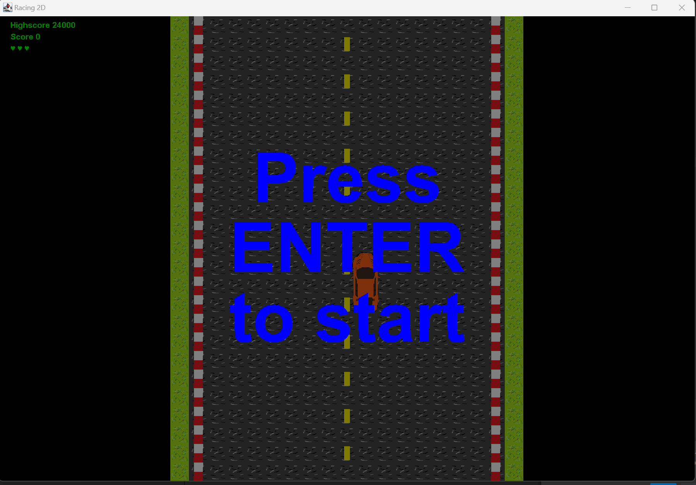

# Racing2D (Game)

This is a 2D car racing game built using Java Swing. The objective of the game is to avoid obstacles and earn points by driving as far as possible.

## How to Play

Use the arrow keys to move the car left and right, avoiding obstacles on the road. The game starts with three lives, and you lose a life each time you hit an obstacle. The game ends when you lose all three lives.

## Features

- Simple 2D graphics
- Randomly generated obstacles
- Scoring system with high score tracking
- Game over and game start screens
- Audio effects

## Installation

To play the game, (fork and) clone this repository to your computer and run the Main class.

## Requirements

Java 8 or higher

## Credits

This game was created by Aleksander L. Fedøy as a project for INF101 at the University of Bergen spring of 2023.

## License

Feel free to use and modify this project as you see fit for non-commercial use. For commercial use please contact me.

The song and cars have been pulled from the internet and might be under copyright restrictions. Continue on your own risk.

## Known Issues

- The main car can be placed outside of the road when resizing the window.
- Obstacle cars can be placed outside of the road when resizing the window.

## Acknowledgments

For transparency, I would like to acknowledge the assistance I received during the development of this project. Javadoc comments and automated tests were mostly generated by OpenAI's ChatGPT, although I made modifications to ensure accuracy. ChatGPT was also used to debug and optimize the code and move the project forward. While I worked independently to find solutions, I did collaborate with other students on occasion, but mostly to assist them with their code.

## Video tutorial

A short video tutorial (in Norwegian) of the game is available at https://youtu.be/1cor0abduNg
